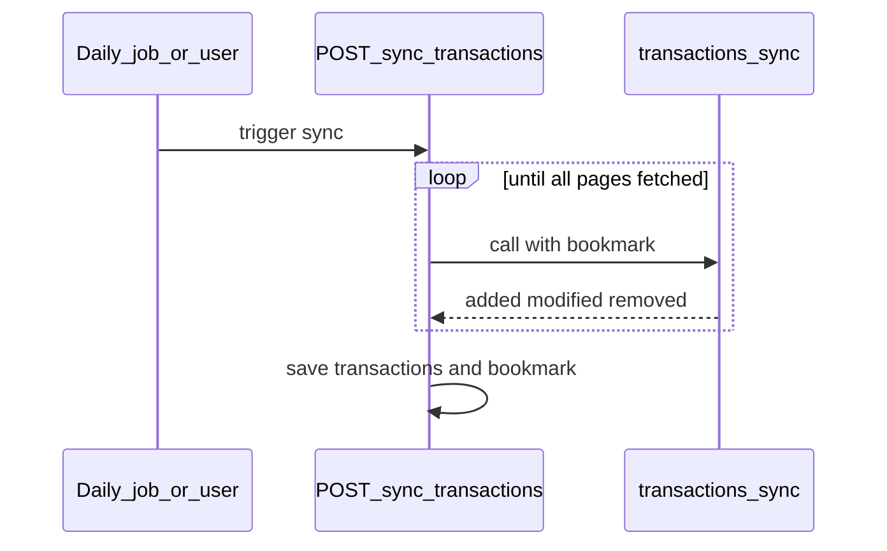
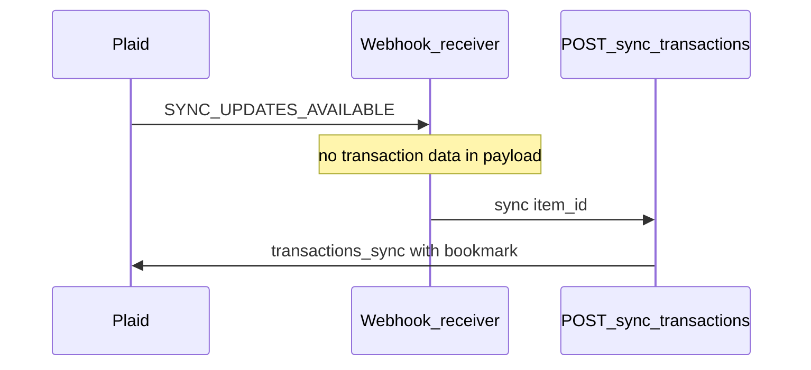

# Cash flow APIs

### Description

Syncs user transaction history and exposes read endpoints for cash-flow features — spending, income, trends, and recurring detection.

**v1 scope:** Transaction sync plus recurring-transactions read API; other chart/list read endpoints are future. v1 uses scheduled and on-demand sync only; Plaid webhooks are an optional future trigger. See [outline-plaid-insight cash-flow examples](../../../outline-plaid-insight/examples/README.md#cash-flow).

**Formatting:** Apply [output formatting](../../../outline-plaid-insight/SKILL.md#output-formatting) — dollar fields 2 dp.

**Prerequisite:** User must have linked accounts with transaction access enabled.

### What this feeds

Cash-flow features read from stored transactions joined with account info — see [cash flow core](../../../outline-plaid-insight/examples/cash-flow/cash-flow-core.md). This endpoint only imports transactions; it does not run those calculations.

---

### Sync APIs

#### POST /v1/plaid/sync/transactions

- **Where data comes from:** Plaid's `/transactions/sync` API, once per linked bank connection — see [plaid-api-schema.md](../../../outline-plaid-insight/plaid-api-schema.md#transactionssync). Do not use the legacy `/transactions/get` endpoint.
- **Datatable writes:** `plaid_transactions` — new and updated rows are saved or updated; deleted rows are marked removed (not erased). Transaction payloads are **written directly to the database during sync**; they are **not** returned in the API response. Field mapping: [plaid_transactions](../../../outline-plaid-insight/plaid-api-schema.md#plaid_transactions). Clients load transaction data later via future read endpoints (see [Read APIs](#read-apis)).

**What each stored transaction includes**

These fields describe what is persisted in `plaid_transactions` — not what the sync response returns.

Plaid returns changes in `added[]`, `modified[]`, and `removed[]`. New and updated transactions share the same fields:

| Field | Type | Description |
|---|---|---|
| `transaction_id` | string | Unique ID |
| `account_id` | string | Linked account |
| `amount` | number | Positive = money out; negative = money in |
| `date` | date | Posted date |
| `authorized_date` | date \| null | Authorization date — often empty |
| `name` | string | Raw bank description |
| `merchant_name` | string \| null | Cleaned merchant name — preferred for display |
| `pending` | boolean | Not yet posted — excluded from most charts |
| `payment_channel` | string | `online`, `in store`, or `other` |
| `personal_finance_category.primary` | string | Top-level spend/income category — see [enum_pfc_primary](../../../outline-plaid-insight/plaid-api-schema.md#enum_pfc_primary) |
| `personal_finance_category.detailed` | string | More specific category — see [enum_pfc_detailed](../../../outline-plaid-insight/plaid-api-schema.md#enum_pfc_detailed) |
| `personal_finance_category.confidence_level` | string | Category confidence — see [enum_pfc_confidence_level](../../../outline-plaid-insight/plaid-api-schema.md#enum_pfc_confidence_level) |
| `location.city` | string \| null | City — often empty |
| `location.region` | string \| null | State/region — often empty |
| `iso_currency_code` | string \| null | Currency (e.g. USD) |
| `unofficial_currency_code` | string \| null | Non-standard currency |

Legacy `category[]` is not returned — use `personal_finance_category` instead.

**Removals:** Plaid sends only `transaction_id` in `removed[]`. Import finds the existing row and sets `removed = true` — the row is kept, not erased. There is no separate storage table for removed transactions.

**How fields are stored** — nested Plaid fields are flattened when saved:

| Stored column | From |
|---|---|
| `personal_finance_category_primary` | `personal_finance_category.primary` |
| `personal_finance_category_detailed` | `personal_finance_category.detailed` |
| `personal_finance_category_confidence_level` | `personal_finance_category.confidence_level` |
| `location_city` | `location.city` |
| `location_region` | `location.region` |
| `removed` | Set by import when transaction appears in `removed[]` |
| `user_id`, `item_id`, `synced_at` | Added by server on import |

All other stored columns match the Plaid field name directly. Full column list: [plaid_transactions](../../../outline-plaid-insight/plaid-api-schema.md#plaid_transactions).

Not included per transaction: investment buys/sells; full account details (partial `accounts[]` in the Plaid response is ignored).

- **How we track progress:** Server saves a sync bookmark (`transactions_sync_cursor`) per bank connection in `plaid_items` — see [plaid_items](../../../outline-plaid-insight/plaid-api-schema.md#plaid_items). Bookmarks are server-managed; clients cannot supply their own.

- **Request:**

| Parameter | Type | Required | Notes |
|---|---|---|---|
| `item_id` | string | no | Sync one bank only. Leave blank to sync all. |
| `force_refresh` | boolean | no | **Optional.** Ask the bank for the latest data before syncing. Omit or pass `false` for scheduled and routine syncs; use sparingly when `true`. |

- **How it works:**

  1. Find the user's active bank connections (filter by `item_id` if provided); skip connections without transaction access
  2. Load the saved sync bookmark (`transactions_sync_cursor`) for each connection from `plaid_items`
  3. **(Optional)** If `force_refresh` is `true`, request fresh data from the bank first (`/transactions/refresh`). Skip this step when omitted or `false`.
  4. Fetch all pages of changes from `/transactions/sync` until complete — path depends on whether a bookmark exists:
     - **First-time sync** (`transactions_sync_cursor` is `null`): omit cursor; pass `options.days_requested: 730` to request up to 2 years of history
     - **Subsequent sync** (bookmark exists): pass saved `transactions_sync_cursor` from `plaid_items`; Plaid returns only changes since that cursor
     - **Both paths:** new and updated transactions → save or update in `plaid_transactions`; removed transactions → mark as deleted (`removed = true`); row is kept, not erased
  5. Save the new bookmark (`next_cursor` from the final page) to `plaid_items.transactions_sync_cursor` only after a full successful sync
  6. Ignore account info in the Plaid response — use balance sync for account lists ([import guidance](../../../outline-plaid-insight/plaid-api-schema.md#import-guidance-for-plaid_accounts))

- **Response:**

Summary only — confirms import finished. **Does not include transaction rows.** Full transaction data lives in `plaid_transactions` after sync; future read endpoints query that table (see [Read APIs](#read-apis)).

| Field | Type | Description |
|---|---|---|
| `synced_at` | timestamp | When this import finished |
| `items[]` | array | Per-connection import summary — one element per bank connection synced |
| `items[].item_id` | string | Bank connection ID |
| `items[].transactions_added` | number | New rows written to `plaid_transactions` for this connection |
| `items[].transactions_modified` | number | Existing rows updated in `plaid_transactions` for this connection |
| `items[].transactions_removed` | number | Rows marked `removed = true` in `plaid_transactions` for this connection |
| `items[].cursor_updated` | boolean | Whether `plaid_items.transactions_sync_cursor` was saved |
| `transactions_added` | number | New transactions written to `plaid_transactions` (total across all connections) |
| `transactions_modified` | number | Existing rows updated in `plaid_transactions` (total across all connections) |
| `transactions_removed` | number | Rows marked `removed = true` in `plaid_transactions` (total across all connections) |
| `errors[]` | array | Optional — connections that failed: `{ item_id, error_code, message }` |

**When sync runs**

#### Layer 1 — Current (v1): poll and schedule

v1 triggers `POST /v1/plaid/sync/transactions` directly — no webhook infrastructure required.

| Trigger | When |
|---|---|
| **On link** | First sync immediately after user connects a bank — populates history and initializes Plaid's sync state |
| **Daily job** | Once per day in background for all bank connections |
| **Pull-to-refresh** | User-initiated; rate-limited; may pass optional `force_refresh: true` |

Plaid returns changes in **pages** (default ~100 per response). The server loops until all pages are fetched before saving the sync bookmark.

Sync never runs when loading a chart or list.

#### Layer 2 — Optional: webhook trigger (future)

Separate Plaid integration — not part of `/transactions/sync` and not required for v1. Architecture only; no webhook route spec here.

When enabled, Plaid POSTs `SYNC_UPDATES_AVAILABLE` to a configured webhook URL (set at Link time) when transaction updates are ready for an Item. The webhook payload does **not** include transaction data — it only signals that sync should run for that `item_id`.

| Topic | Detail |
|---|---|
| **What it does** | Triggers `POST /v1/plaid/sync/transactions` scoped to the webhook's `item_id` |
| **Prerequisite** | `/transactions/sync` must have run at least once for that Item before webhooks start firing |
| **Legacy webhooks** | Do not use `DEFAULT_UPDATE`, `INITIAL_UPDATE`, or `HISTORICAL_UPDATE` with the sync model — use `SYNC_UPDATES_AVAILABLE` only — see [Plaid sync migration guide](https://plaid.com/docs/transactions/sync-migration/) |
| **Keep daily job** | Even with webhooks, daily sync remains a backstop for missed or failed webhook deliveries |
| **Engineering scope** | Webhook receiver, verification, and deduping — out of scope for v1 API spec |

**Rules:**

| Rule | Detail |
|---|---|
| **Safe to run again** | Won't duplicate transactions — each transaction is saved or updated by ID |
| **One connection at a time** | Each bank connection syncs independently |
| **Failures are isolated** | One bank failing doesn't block the others; retry failed connections with backoff |
| **Bookmark on success only** | Don't advance the sync bookmark if a page fails mid-sync |
| **Transaction access required** | Connection must have the Transactions product enabled |

**Out of scope:**

- Plaid webhook receiver (`SYNC_UPDATES_AVAILABLE`) — optional future layer; not in v1
- Investment buys and sells — separate Plaid product, not imported here
- Plaid's built-in recurring-bill detection — [recurring transactions](../../../outline-plaid-insight/examples/cash-flow/recurring-transactions.md) detects patterns from stored transactions instead
- Account lists — use `POST /v1/plaid/sync/balances` or `GET /v1/accounts` — see [net worth APIs](../net-worth/net-worth-apis.md)

---

### Read APIs

Read endpoints query `plaid_transactions` (and related tables) — they never call Plaid at runtime. Calculations follow [cash flow core](../../../outline-plaid-insight/examples/cash-flow/cash-flow-core.md).

**Future read endpoints** (not yet specified):

| Insight | Spec |
|---|---|
| Monthly spending by category | [monthly-spending-by-category.md](../../../outline-plaid-insight/examples/cash-flow/monthly-spending-by-category.md) |
| Cash inflow and outflow chart | [cash-inflow-outflow-chart.md](../../../outline-plaid-insight/examples/cash-flow/cash-inflow-outflow-chart.md) |
| Top 5 biggest purchases | [top-5-biggest-purchases.md](../../../outline-plaid-insight/examples/cash-flow/top-5-biggest-purchases.md) |

#### GET /v1/cash-flow/recurrences

- **Parameters:**

| Parameter | Type | Default | Notes |
|---|---|---|---|
| `week_start` | date | Sunday of week containing `as_of` | Sunday that starts the 7-day calendar window; server normalizes to preceding Sunday when not already Sunday |
| `group` | enum | omitted | Optional filter: `bills`, `income`, `subscriptions`, `transfers`, `other_inflow` |
| `account_ids` | `string[]` | omitted | Omitted → all accounts; reject if any ID not found (do not silently drop) |
| `history_months` | integer | `3` | Pass-through to insight — 0–12; calendar months of actual occurrences |
| `projection_months` | integer | `6` | Pass-through to insight — 0–12; must cover `week_start`..`week_end` (see invariant below) |

- **Calculation:** [recurring-transactions.md](../../../outline-plaid-insight/examples/cash-flow/recurring-transactions.md) steps 1–13 on [cash flow core](../../../outline-plaid-insight/examples/cash-flow/cash-flow-core.md):

  1. **Run insight** — full detection pipeline with `history_months` and `projection_months`; produce `as_of`, `history_start`, `projection_end`, `recurrences[]`, `by_group[]`, `by_account[]`
  2. **Validate projection** — if `week_end > projection_end`, return `400` with guidance to raise `projection_months` (max 12)
  3. **Resolve `week_start`** — default to Sunday of week containing `as_of`; normalize non-Sunday values to preceding Sunday; `week_end = week_start + 6`
  4. **Assign `recurrence_id`** — per row: deterministic hash of `account_id` + `direction` + normalized `merchant_name` (trim, case-fold)
  5. **Apply filters** *(when `group` or `account_ids` passed)* — filter `recurrences[]`; recompute `by_group[]` and `by_account[]` from filtered rows only
  6. **Build `calendar.days[]`** — emit 7 entries from `week_start` through `week_end`; for each day, `items[]` = occurrences from each recurrence's `occurrences[]` where `date` equals that day; each item: `{ recurrence_id, merchant_name, amount, direction }` (`amount` always positive; client signs/colors by `direction`)
  7. **Build `upcoming[]`** — recurrences with at least one projected occurrence where `date` ∈ `[as_of, as_of + 2]`; each element is the full recurrence object; sort by earliest matching projected `date`, then `merchant_name`

- **Response:**

| Field | Type | Description |
|---|---|---|
| `as_of` | date | Insight reference date (today) |
| `history_start` | date | Start of actual-occurrence window |
| `projection_end` | date | End of projected-occurrence window |
| `week_start` | date | Resolved Sunday for calendar window |
| `week_end` | date | `week_start + 6` |
| `calendar` | object | `{ days[] }` — powers weekly calendar strip |
| `calendar.days[]` | array | `{ date, items[] }` where `items[]` is `{ recurrence_id, merchant_name, amount, direction }` |
| `recurrences` | array | Full recurrence rows — powers zoom-in detail on any day/cell |
| `upcoming` | array | Full recurrence rows due in next 3 days from `as_of` — powers "Upcoming next 3 days" panel |
| `by_group` | array | `{ group, estimated_monthly_total }` — from filtered `recurrences[]` when filters applied |
| `by_account` | array | `{ account_id, account_name, account_mask, estimated_monthly_total }` — same |

**Recurrence object** (`recurrences[]` and `upcoming[]`):

| Field | Type | Description |
|---|---|---|
| `recurrence_id` | string | Stable ID — hash of `account_id` + `direction` + normalized `merchant_name` |
| `merchant_name` | string | Display label |
| `account_id` | string | Linked account |
| `account_name` | string | Account display name |
| `account_mask` | string \| null | Last digits |
| `category` | string | Plaid primary category |
| `group` | string | `bills`, `income`, `subscriptions`, `transfers`, or `other_inflow` |
| `direction` | string | `inflow` or `outflow` |
| `frequency` | string | `weekly`, `biweekly`, `monthly`, or `annual` |
| `median_gap_days` | integer | Median gap between occurrences |
| `typical_amount` | number | Median amount (always positive) |
| `last_date` | date | Most recent occurrence |
| `next_date` | date | Projected next occurrence on or after `as_of` |
| `occurrence_count` | integer | Count in detection group |
| `occurrences[]` | array | `{ date, amount, kind, transaction_id? }` — `kind` is `actual` or `projected` |

- **Powers:** Recurring transactions weekly calendar (Sun–Sat strip with merchant amounts), day-cell zoom-in detail, and "Upcoming next 3 days" list — all from one response
- **Invariants:** Every `calendar.days[].items[].recurrence_id` resolves to exactly one row in `recurrences[]`; `upcoming[]` ⊆ `recurrences[]` (same `recurrence_id` values)
- **Out of scope (client-owned):** `merchant_logo_url` (not in Plaid datatables — client brand lookup from `merchant_name`); status text ("Due today", "Due tomorrow") — client compares `next_date` or occurrence `date` to `as_of`; month header — client formats from `week_start` or selected day

---

### Client composition

**Recurring transactions calendar screen** — sync first, then read:

| Call | Purpose |
|---|---|
| `POST /v1/plaid/sync/transactions` | Import latest transactions into `plaid_transactions` (response is counts only) |
| `GET /v1/cash-flow/recurrences` | Weekly calendar + zoom-in detail + upcoming panel |

| UI element | Client action |
|---|---|
| Week strip | Render `calendar.days[]`; highlight selected day locally |
| Chevron `<` / `>` | `week_start -= 28` / `+= 28`; re-call same endpoint |
| Day cell tap (zoom-in) | Look up `recurrences[]` by `recurrence_id` from `calendar.days[].items[]` |
| "Upcoming next 3 days" | Render `upcoming[]`; subtitle as `{frequency} • {relative status}` |
| Income vs expense styling | `direction === 'inflow'` → prefix `+` and income color |

**Other cash-flow screens (future)** — sync first, then read:

| Call | Purpose |
|---|---|
| `POST /v1/plaid/sync/transactions` | Import latest transactions |
| *(future read endpoints)* | Charts and lists from `plaid_transactions` — never call Plaid directly |

**Before using cash-flow features:**

- User must have linked accounts with transaction access
- Balance sync (`POST /v1/plaid/sync/balances`) is recommended so features know account type (checking vs credit) — not required for import itself

**Rules for charts and lists:**

- Exclude pending transactions (not yet posted)
- Exclude removed transactions (marked as deleted during sync)
- Transaction sync does not update account balances or account lists
