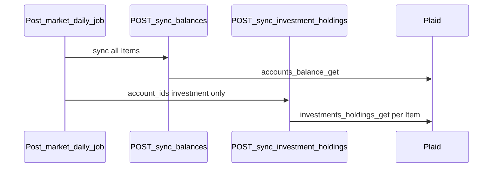
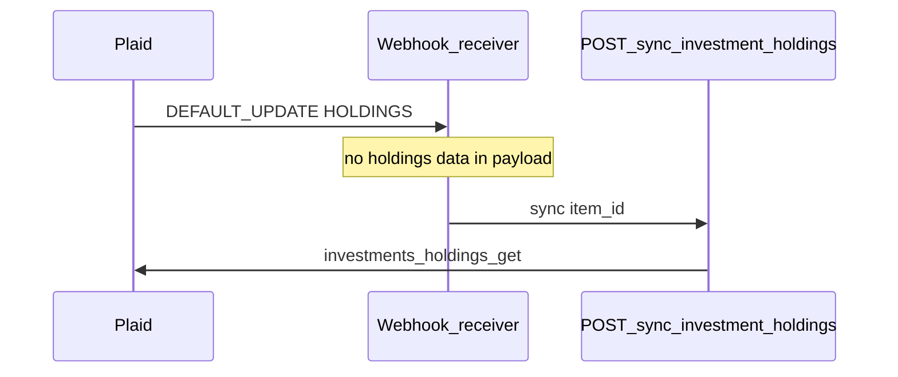

# Investment account APIs

### Description

Keeps investment holdings and securities up to date so investment features can show portfolio performance, holdings by value, and asset allocation.

**v1 scope:** Sync only — charts and lists use separate read endpoints (see [outline-plaid-insight investment-account examples](../../../outline-plaid-insight/examples/README.md#investment-account)). v1 uses a post-market daily job, conditional page-load fallback, and on-demand pull-to-refresh; Plaid `HOLDINGS` webhooks are an optional v2 trigger.

**Formatting:** Apply [output formatting](../../../outline-plaid-insight/SKILL.md#output-formatting) — dollar fields 2 dp; fraction percent fields 3 dp.

### What this feeds

Investment features read from `plaid_investment_holdings`, `plaid_investment_securities`, and `plaid_accounts` — see insight specs below. These endpoints only import data; they do not run those calculations.

- Performance chart: [investment-performance-chart.md](../../../outline-plaid-insight/examples/investment-account/investment-performance-chart.md) via [net worth core](../../../outline-plaid-insight/examples/net-worth/net-worth-core.md)
- Holdings list: [holdings-by-value.md](../../../outline-plaid-insight/examples/investment-account/holdings-by-value.md)
- Asset allocation: [asset-allocation.md](../../../outline-plaid-insight/examples/investment-account/asset-allocation.md)

Balance sync response shape and `plaid_accounts` mapping: [net-worth-apis.md § sync/balances](../net-worth/net-worth-apis.md#post-v1plaidsyncbalances) — do not duplicate here.

---

### Sync APIs

#### POST /v1/plaid/sync/balances

Cross-reference — full spec at [net-worth-apis.md § sync/balances](../net-worth/net-worth-apis.md#post-v1plaidsyncbalances).

- **Investment page role:** Call only when balances are **stale** (see [When sync runs on the investment page](#when-sync-runs-on-the-investment-page)); response `accounts[]` is the account list when sync runs. When fresh, use latest `plaid_accounts` rows (e.g. via `GET /v1/account-balance` filtered to `type = investment`) for account discovery.
- **Investment-specific client handling:**
  1. Filter `accounts[]` where `type = investment`
  2. Sort by `balances_current` descending — flat list; no institution grouping
  3. Display balance from `balances_current` (not `balances_margin_loan_amount` — always `null` until holdings sync)
  4. Collect `account_id` values for holdings sync

#### POST /v1/plaid/sync/investment-holdings

- **Plaid source:** `/investments/holdings/get` per active investment Item — see [plaid-api-schema.md](../../../outline-plaid-insight/plaid-api-schema.md#investmentsholdingsget); pass `options.account_ids` from request
- **Datatable writes:** `plaid_investment_holdings`, `plaid_investment_securities`
- **Optional enrichment:** patch `plaid_accounts.balances_margin_loan_amount` on matching investment account rows from `/investments/holdings/get` response `accounts[]` — margin loan borrowed against the portfolio; investment endpoints only; often `null`
- **Request:**

| Parameter | Type | Required | Notes |
|---|---|---|---|
| `account_ids` | `string[]` | yes | Investment account IDs from balance sync filter; reject unknown IDs |
| `item_id` | string | no | Further scope to one Plaid Item when known |

- **Response:**

| Field | Type | Description |
|---|---|---|
| `synced_at` | timestamp | Import timestamp |
| `holdings_synced` | number | Count of holding rows written |
| `securities_synced` | number | Count of security rows written |

- **Powers:** Populates `plaid_investment_holdings` and `plaid_investment_securities`; feeds recommendation jobs that depend on allocation or concentration

**When sync runs**

#### Layer 1 — Current (v1): post-market schedule

v1 triggers `POST /v1/plaid/sync/investment-holdings` via background job and conditional page-load fallback — no webhook infrastructure required.

| Trigger | When |
|---|---|
| **On link** | First holdings sync immediately after user connects an investment Item — after initial `sync/balances` |
| **Post-market daily job** | Once per calendar day after US market close (recommend **8:00 PM ET** or later) for all users with investment Items — primary schedule |
| **Page load (fallback)** | Only when holdings are **stale** — last successful `plaid_investment_holdings.synced_at` is before the most recent post-market cutoff |
| **Pull-to-refresh** | User-initiated; rate-limited; always sync regardless of staleness |

**Daily job orchestration** (per user, all Items):

1. `POST /v1/plaid/sync/balances` — all Items (may share the net-worth daily job if scheduled at the same time)
2. Collect `account_id` where `type = investment` from latest balance snapshot
3. `POST /v1/plaid/sync/investment-holdings` with those `account_ids[]` — one Plaid call per investment Item

Align job time with Plaid's typical overnight investment refresh (after market close). Do not call Plaid on every read.

| Concern | Rule |
|---|---|
| **Scope** | One Plaid call per Item; pass `account_ids` as `options.account_ids` |
| **Prerequisite** | `POST /v1/plaid/sync/balances` must run first so investment `account_ids` are known |
| **Frequency** | Once daily post-market per user (all investment Items); do not call Plaid on every read |
| **Failure** | Per-Item errors do not block other Items; retry with backoff; stale holdings served from last successful sync |
| **On-demand** | Page-load fallback and pull-to-refresh only when stale or user-initiated; rate-limit to avoid duplicate Plaid calls within a short window |
| **Margin enrichment** | Update `balances_margin_loan_amount` only when present in holdings response; leave null otherwise |

**Staleness check** — holdings are **fresh** when `MAX(plaid_investment_holdings.synced_at)` for the user is on or after the most recent post-market cutoff (`8:00 PM ET` on the prior calendar day if current time is before tonight's cutoff; otherwise tonight's cutoff). Balances use the same pattern against `plaid_accounts.synced_at`. Never synced → stale.

#### Layer 2 — Optional: webhook trigger (v2)

Separate Plaid integration — not part of `POST /v1/plaid/sync/investment-holdings` and not required for v1. Architecture only; no webhook route spec here.

When enabled, Plaid POSTs `DEFAULT_UPDATE` with `webhook_type = HOLDINGS` when holdings quantities or prices change for an Item. The webhook payload does **not** include holdings data — it only signals that sync should run for that `item_id`.

| Topic | Detail |
|---|---|
| **What it does** | Triggers `POST /v1/plaid/sync/investment-holdings` scoped to the webhook's `item_id` (investment `account_ids` from latest balance sync for that Item) |
| **Prerequisite** | Holdings sync must have run at least once for that Item before webhooks are meaningful |
| **Keep daily job** | Even with webhooks, post-market daily sync remains a backstop for missed or failed webhook deliveries |
| **Engineering scope** | Webhook receiver, verification, and deduping — out of scope for v1 API spec |

Sync never runs when loading a chart or list unless data is stale or the user pulls to refresh.

---

### When sync runs on the investment page

Conditional sync fallback — read endpoints are out of scope here; see [What this feeds](#what-this-feeds).

| Step | Call | Purpose |
|---|---|---|
| 0 | *(server)* | Staleness check — skip steps 1 and 2 when balances and holdings are fresh |
| 1 | `POST /v1/plaid/sync/balances` | **If balances stale** — see [net-worth-apis.md](../net-worth/net-worth-apis.md#post-v1plaidsyncbalances) |
| 2 | `POST /v1/plaid/sync/investment-holdings` with `account_ids[]` | **If holdings stale** — investment `account_ids` from latest balance snapshot where `type = investment` |

**Pull-to-refresh:** always run steps 1 and 2 (rate-limited); optionally call Plaid `/investments/refresh` before holdings sync when fresher institution data is required.

**Post-market daily job** runs steps 1 → 2 for all users with investment Items — page load should not duplicate Plaid calls when step 0 finds fresh data.
