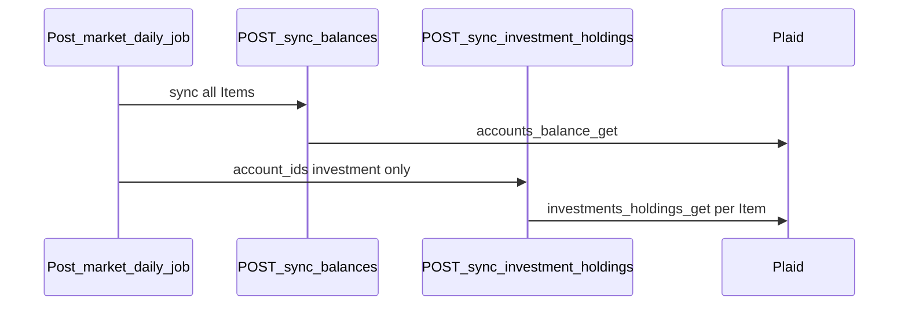
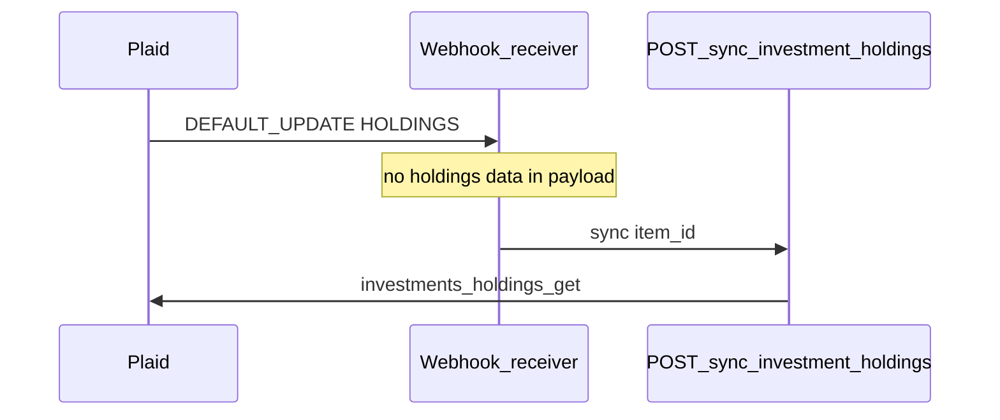

# Investment account APIs

### Description

Investment overview: portfolio performance, flat account list, holdings by value, and asset allocation. Sync endpoints keep holdings and securities fresh; read endpoints query datatables only — never call Plaid at runtime.

**v1 scope:** Post-market daily job, conditional page-load fallback, and on-demand pull-to-refresh; Plaid `HOLDINGS` webhooks are an optional v2 trigger. See [outline-plaid-insight investment-account examples](../../../outline-plaid-insight/examples/README.md#investment-account).

**Formatting:** Apply [output formatting](../../../outline-plaid-insight/SKILL.md#output-formatting) — dollar fields 2 dp; fraction percent fields 3 dp.

### Insight mapping

| Feature | Insight spec | API |
|---|---|---|
| Performance chart | [investment-performance-chart.md](../../../outline-plaid-insight/examples/investment-account/investment-performance-chart.md) | Reuse `GET /v1/performance-history` — [net-worth-apis.md](../net-worth/net-worth-apis.md#get-v1performance-history) |
| Account list | — | Reuse `GET /v1/account-balance` — flat investment filter, no institution grouping |
| Holdings list | [holdings-by-value.md](../../../outline-plaid-insight/examples/investment-account/holdings-by-value.md) | `GET /v1/investment/holdings` |
| Asset allocation | [asset-allocation.md](../../../outline-plaid-insight/examples/investment-account/asset-allocation.md) | `GET /v1/investment/allocation` |

Balance sync response shape and `plaid_accounts` mapping: [net-worth-apis.md § sync/balances](../net-worth/net-worth-apis.md#post-v1plaidsyncbalances) — do not duplicate here.

---

### Sync APIs

#### POST /v1/plaid/sync/balances

Cross-reference — full spec at [net-worth-apis.md § sync/balances](../net-worth/net-worth-apis.md#post-v1plaidsyncbalances).

- **Investment page role:** Call only when balances are **stale** (see [When sync runs on the investment page](#when-sync-runs-on-the-investment-page)); response `accounts[]` is the account list when sync runs. When fresh, use latest `plaid_accounts` rows (e.g. via `GET /v1/account-balance` filtered to `type = investment`) for account discovery.
- **Investment-specific client handling:**
  1. Filter `accounts[]` where `type = investment` (or `group = investment` on read path)
  2. Sort by balance descending — flat list; **do not group by `institution_name`**
  3. Display balance from `balances_current` on sync response (not `balances_margin_loan_amount` — often `null` until holdings sync)
  4. Collect `account_id` values for holdings sync

#### POST /v1/plaid/sync/investment-holdings

- **Plaid source:** `/investments/holdings/get` per active investment Item — see [plaid-api-schema.md](../../../outline-plaid-insight/plaid-api-schema.md#investmentsholdingsget); pass `options.account_ids` from request
- **Datatable writes:** `plaid_investment_holdings`, `plaid_investment_securities`
- **Optional enrichment:** patch `plaid_accounts.balances_margin_loan_amount` on matching investment account rows from `/investments/holdings/get` response `accounts[]` — margin loan borrowed against the portfolio; investment endpoints only; often `null`
- **Request:**

| Parameter | Type | Required | Notes |
|---|---|---|---|
| `account_ids` | `string[]` | yes | Investment account IDs from balance sync filter; reject unknown IDs |
| `item_id` | string | no | Further scope to one Plaid Item when known |

- **Response:**

| Field | Type | Description |
|---|---|---|
| `synced_at` | timestamp | Import timestamp |
| `holdings_synced` | number | Count of holding rows written |
| `securities_synced` | number | Count of security rows written |

- **Powers:** Populates `plaid_investment_holdings` and `plaid_investment_securities`; feeds recommendation jobs that depend on allocation or concentration

**When sync runs**

#### Layer 1 — Current (v1): post-market schedule

v1 triggers `POST /v1/plaid/sync/investment-holdings` via background job and conditional page-load fallback — no webhook infrastructure required.

| Trigger | When |
|---|---|
| **On link** | First holdings sync immediately after user connects an investment Item — after initial `sync/balances` |
| **Post-market daily job** | Once per calendar day after US market close (recommend **8:00 PM ET** or later) for all users with investment Items — primary schedule |
| **Page load (fallback)** | Only when holdings are **stale** — last successful `plaid_investment_holdings.synced_at` is before the most recent post-market cutoff |
| **Pull-to-refresh** | User-initiated; rate-limited; always sync regardless of staleness |

**Daily job orchestration** (per user, all Items):

1. `POST /v1/plaid/sync/balances` — all Items (may share the net-worth daily job if scheduled at the same time)
2. Collect `account_id` where `type = investment` from latest balance snapshot
3. `POST /v1/plaid/sync/investment-holdings` with those `account_ids[]` — one Plaid call per investment Item

Align job time with Plaid's typical overnight investment refresh (after market close). Do not call Plaid on every read.

| Concern | Rule |
|---|---|
| **Scope** | One Plaid call per Item; pass `account_ids` as `options.account_ids` |
| **Prerequisite** | `POST /v1/plaid/sync/balances` must run first so investment `account_ids` are known |
| **Frequency** | Once daily post-market per user (all investment Items); do not call Plaid on every read |
| **Failure** | Per-Item errors do not block other Items; retry with backoff; stale holdings served from last successful sync |
| **On-demand** | Page-load fallback and pull-to-refresh only when stale or user-initiated; rate-limit to avoid duplicate Plaid calls within a short window |
| **Margin enrichment** | Update `balances_margin_loan_amount` only when present in holdings response; leave null otherwise |

**Staleness check** — holdings are **fresh** when `MAX(plaid_investment_holdings.synced_at)` for the user is on or after the most recent post-market cutoff (`8:00 PM ET` on the prior calendar day if current time is before tonight's cutoff; otherwise tonight's cutoff). Balances use the same pattern against `plaid_accounts.synced_at`. Never synced → stale.

#### Layer 2 — Optional: webhook trigger (v2)

Separate Plaid integration — not part of `POST /v1/plaid/sync/investment-holdings` and not required for v1. Architecture only; no webhook route spec here.

When enabled, Plaid POSTs `DEFAULT_UPDATE` with `webhook_type = HOLDINGS` when holdings quantities or prices change for an Item. The webhook payload does **not** include holdings data — it only signals that sync should run for that `item_id`.

| Topic | Detail |
|---|---|
| **What it does** | Triggers `POST /v1/plaid/sync/investment-holdings` scoped to the webhook's `item_id` (investment `account_ids` from latest balance sync for that Item) |
| **Prerequisite** | Holdings sync must have run at least once for that Item before webhooks are meaningful |
| **Keep daily job** | Even with webhooks, post-market daily sync remains a backstop for missed or failed webhook deliveries |
| **Engineering scope** | Webhook receiver, verification, and deduping — out of scope for v1 API spec |

Sync never runs when loading a chart or list unless data is stale or the user pulls to refresh.

---

### When sync runs on the investment page

Conditional sync fallback before [Read APIs](#read-apis) — see [Client composition](#client-composition).

| Step | Call | Purpose |
|---|---|---|
| 0 | *(server)* | Staleness check — skip steps 1 and 2 when balances and holdings are fresh |
| 1 | `POST /v1/plaid/sync/balances` | **If balances stale** — see [net-worth-apis.md](../net-worth/net-worth-apis.md#post-v1plaidsyncbalances) |
| 2 | `POST /v1/plaid/sync/investment-holdings` with `account_ids[]` | **If holdings stale** — investment `account_ids` from latest balance snapshot where `type = investment` |

**Pull-to-refresh:** always run steps 1 and 2 (rate-limited); optionally call Plaid `/investments/refresh` before holdings sync when fresher institution data is required.

**Post-market daily job** runs steps 1 → 2 for all users with investment Items — page load should not duplicate Plaid calls when step 0 finds fresh data.

---

### Read APIs

Read endpoints query `plaid_investment_holdings`, `plaid_investment_securities`, and `plaid_accounts` — they never call Plaid at runtime.

#### GET /v1/investment/holdings

- **Parameters:**

| Parameter | Type | Default | Notes |
|---|---|---|---|
| `account_ids` | `string[]` | omitted | Omitted or empty → all investment accounts (portfolio-wide). Non-empty → filter to matching investment accounts only; reject if any ID not found or not `type = investment` (do not silently drop) |
| `limit` | integer | omitted | Omitted → return **all** holdings. Positive integer → return top N by `total_value` descending (e.g. `limit=5` for largest five). Reject `limit < 1` |

- **Calculation:** [holdings-by-value.md](../../../outline-plaid-insight/examples/investment-account/holdings-by-value.md) steps 1–7, with optional account scope before aggregation:

  1. **Load snapshot** — latest `synced_at` from `plaid_accounts` for user
  2. **Resolve account scope** — all investment `account_id` values at snapshot, or validate and filter to requested `account_ids`
  3. **Load holdings** — join `plaid_investment_holdings` + `plaid_investment_securities` at same `synced_at`; exclude null `institution_value`
  4. **Aggregate by security** — group by `security_id`; `total_value` = sum of `institution_value` across scoped accounts
  5. **Sort** — by `total_value` descending
  6. **Apply `limit`** — when set, take first `limit` rows after sort; set `total_holdings_count` to full row count before cap
  7. **Format output** — dollar fields 2 dp

- **Response:**

| Field | Type | Description |
|---|---|---|
| `account_ids` | `string[]` \| null | Echo requested IDs when non-empty; else `null` |
| `as_of` | timestamp | `synced_at` of snapshot used |
| `total_holdings_count` | number | Full count of aggregated securities before `limit` cap |
| `holdings[]` | array | `{ security_id, ticker_symbol, name, total_value }` — sorted by `total_value` desc |

- **Powers:** Full holdings list (omit `limit`); top-N preview (e.g. `limit=5` on overview); per-account or multi-account list via `account_ids[]`

#### GET /v1/investment/allocation

- **Parameters:**

| Parameter | Type | Default | Notes |
|---|---|---|---|
| `account_ids` | `string[]` | omitted | Omitted or empty → portfolio-wide (all investment accounts). Non-empty → filter to matching investment accounts only; reject if any ID not found or not `type = investment` (do not silently drop) |
| `limit` | integer | omitted | Omitted → return **all** holdings in each asset class. Positive integer → top N holdings by `value` descending **within each** `asset_classes[]` bucket (e.g. `limit=5`). Reject `limit < 1` |

- **Calculation:** [asset-allocation.md](../../../outline-plaid-insight/examples/investment-account/asset-allocation.md) steps 1–8, with optional account scope and per-class holdings cap:

  1. **Load snapshot** — latest `synced_at` from `plaid_accounts` for user
  2. **Resolve account scope** — all investment accounts, or validate and filter to requested `account_ids`
  3. **Load holdings** — join holdings + securities at same `synced_at`; exclude null `institution_value`
  4. **Classify and aggregate** — normalize each security to one of 9 Plaid types via [enum_investment_security_type](../../../outline-plaid-insight/plaid-api-schema.md#enum_investment_security_type); group by `asset_class` + `security_id`; sum `institution_value`
  5. **Build `asset_classes[]`** — class `value` = sum of security values; sort classes by `value` desc; omit zero-value classes
  6. **Percents** — `percent = value / total_investment_value` (0 if denominator 0); fraction 3 dp
  7. **Apply `limit`** — when set, cap each class's `holdings[]` to top N by `value` desc; set `holdings_total_count` per class to full count before cap; class `value` and `percent` unchanged (full class totals)
  8. **Format output** — dollar fields 2 dp; fraction percent fields 3 dp

- **Response:**

| Field | Type | Description |
|---|---|---|
| `account_ids` | `string[]` \| null | Echo requested IDs when non-empty; else `null` |
| `as_of` | timestamp | `synced_at` of snapshot used |
| `total_investment_value` | number | Sum of all class values |
| `asset_classes[]` | array | `{ asset_class, value, percent, holdings_total_count, holdings[] }` — sorted by `value` desc |
| `asset_classes[].asset_class` | string | One of 9 Plaid security types |
| `asset_classes[].value` | number | Class total — sum of all holdings in class (not affected by `limit`) |
| `asset_classes[].percent` | number | Share of `total_investment_value` as fraction (0–1) |
| `asset_classes[].holdings_total_count` | number | Full count of securities in class before `limit` cap |
| `asset_classes[].holdings[]` | array | `{ security_id, name, ticker_symbol, value }` — sorted by `value` desc |

- **Powers:** Portfolio allocation chart + drill-down (omit `limit` for full drill-down); compact drill-down via `limit=5`; single- or multi-account scope via `account_ids[]`

#### Cross-reference — generic net worth read routes

Full specs at [net-worth-apis.md](../net-worth/net-worth-apis.md). Investment-specific client usage below — do not duplicate field tables.

**`GET /v1/account-balance`** — investment account list

- **Call:** `GET /v1/account-balance` (no filter, or pass known investment `account_ids[]`)
- **Client handling:**
  1. Filter `accounts[]` where `group = investment` (or `type = investment`)
  2. Sort by `balance` descending — **flat list; do not group by `institution_name`**
  3. Display `name`, `mask`, `subtype`, `balance`, `institution_name` per row as needed
- **Powers:** Investment overview account list

**`GET /v1/performance-history`** — portfolio performance chart

- **Call:** `GET /v1/performance-history?account_ids[]=<investment ids>&timeframe=…`
- **Client handling:**
  1. Collect investment `account_id` values from `account-balance` filter (or sync response)
  2. Pass as `account_ids[]`; map `points[].value` → `total_value` client-side per [investment-performance-chart.md](../../../outline-plaid-insight/examples/investment-account/investment-performance-chart.md)
- **Powers:** Investment overview line chart + period return label

---

### Client composition

No server BFFs — composite screens call multiple read routes in parallel.

**Investment overview page** — conditional sync ([When sync runs on the investment page](#when-sync-runs-on-the-investment-page)), then parallel reads:

| Call | Purpose |
|---|---|
| `GET /v1/performance-history?account_ids[]=<investment ids>&timeframe=…` | Portfolio line chart + period return |
| `GET /v1/account-balance` | Flat investment account list (client filter + sort; no institution grouping) |
| `GET /v1/investment/allocation` | Allocation chart (optional on same screen) |
| `GET /v1/investment/holdings?limit=5` | Top holdings preview (optional; omit `limit` for full list) |

**Holdings list screen:** sync if stale → `GET /v1/investment/holdings` (omit `limit` for full list; `limit=5` for top-N widget; optional `account_ids[]` for account scope)

**Allocation screen:** sync if stale → `GET /v1/investment/allocation` (omit `limit` for full drill-down; `limit=5` for compact per-class drill-down; optional `account_ids[]` for account scope)

**Cross-endpoint invariants** at latest holdings snapshot:

- `performance-history.points[last].value` (all investment IDs) ≈ sum of `account-balance` investment rows' `balance`
- Portfolio-wide: `allocation.total_investment_value` ≈ sum of `holdings[].total_value` (omit `limit` on holdings)
- Scoped (same `account_ids` on both): `allocation.total_investment_value` ≈ sum of `holdings[].total_value` for that filter (omit `limit` on holdings)
